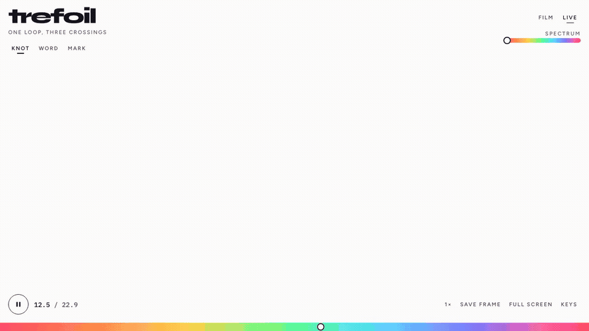

# trefoil

[Live](https://manaiakalani.github.io/trefoil/) · [MIT](LICENSE)

A 16:9 studio for a rainbow trefoil knot. Watch the original film pixel-for-pixel, or recast the same candy in Live — as the knot, as a word, or as a logo.



## Quick start

```bash
npm install
npm run dev
```

Open http://localhost:5173/

```bash
npm run build
npm run preview
```

## Views

- **Film** — the source clip at 1920×1080, 60 fps, 22.883s.
- **Live** — a WebGL trefoil you can drag. Spectrum still shifts the candy.
- **Knot / Word / Mark** — the same rainbow candy, different silhouette. Type a word or character, or drop a PNG, JPEG, WebP, SVG, or GIF (max 8 MB).

Live 3D loads only when you open Live. Phones use a lighter mesh.

## Controls

| Action | |
| --- | --- |
| Play / pause | Space, or the round button |
| Scrub | Rainbow strip, or ← → |
| Spectrum | Top-right slider, or `[` `]` |
| Film / live | `F` / `L` |
| Knot / word / mark | `K` / `W` / `M` |
| Speed | `1` `2` `3` for ½×, 1×, 1½× |
| Save frame | `S` |
| Reset camera | `0` or double-click (live) |
| Hide chrome | `H` |
| Keys | `?` |

URL query `mode`, `t`, `hue`, `speed`, `subject`, and `text` persist the view.

## Deploy

Static Vite app. GitHub Pages builds from `main` (site: [manaiakalani.github.io/trefoil](https://manaiakalani.github.io/trefoil/)).

```bash
npm run build
npx vercel --yes
```

## Security

No server, no accounts, no stored uploads. See [SECURITY.md](SECURITY.md).

## License

[MIT](LICENSE). The film in `public/source.mp4` is the clip this studio was built from.
