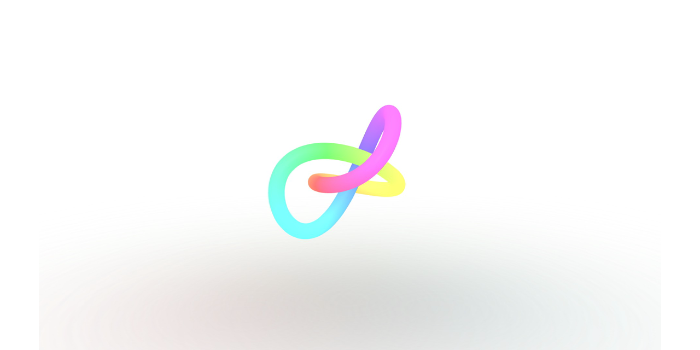

# trefoil

[Live](https://manaiakalani.github.io/trefoil/) · [MIT](LICENSE)

A live 3D rainbow trefoil — one loop, three crossings. Drag it, recast it as a word, or drop a logo. Same candy studio.




## Quick start

```bash
npm install
npm run dev
```

Open http://localhost:5173/

```bash
npm run build
npm run preview
```

## Controls

| Action | |
| --- | --- |
| Play / pause | Space, or the round button |
| Scrub | Rainbow strip, or ← → |
| Spectrum | Top-right slider, or `[` `]` |
| Knot / word / mark | `K` / `W` / `M` |
| Speed | `1` `2` `3` for ½×, 1×, 1½× |
| Save frame | `S` |
| Reset camera | `0` or double-click |
| Hide chrome | `H` |
| Keys | `?` |

URL query `t`, `hue`, `speed`, `subject`, and `text` persist the view.

## Deploy

Static Vite app. GitHub Pages builds from `main`.

```bash
npm run build
```

## Rights

This repository is original WebGL. It does not include third-party video, rips, or stills from anyone else’s clip. Poster, Open Graph, and demo frames are captured from the live studio. Keep reference media of your own off this tree.

## Security

No server, no accounts, no stored uploads. See [SECURITY.md](SECURITY.md).

## License

[MIT](LICENSE) for the code and original assets in this repository.
